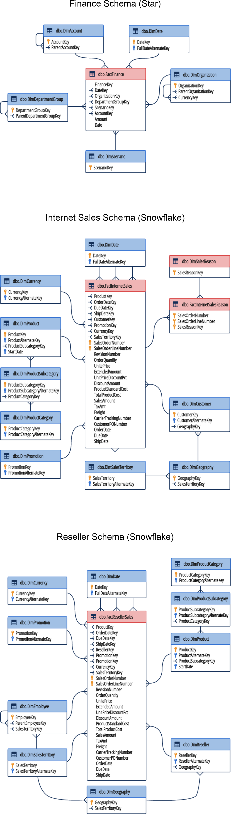

# AdventureWorks Database Warehouse

## Company Overview
• AdventureWorks is a large, multinational manufacturing company.
• It is focused on metal and composite bicycles to North American, European, and Australian commercial markets.
• As at the time of this query, it has 290 employees and several regional sales teams.

## Business Goals:
• To broaden market share by targeting their sales.
• To extend product availability through an external Website.

## About The File
The queries in this project are made from the AdventureWorksDW, and the queries are run on __Azure Data Studio__.

## SQL Credentials
The details to connect to AdventureWorksDW are given below:

- **Server:** prod-sql-cfieducation.database.windows.net
- **Authentication Type:** SQL Login
- **User Name:** BI_User
- **Password:** CFI123456789!
- **Database:** AdventureWorksDW

## Database Schema
The schema for this database is visualized below:

